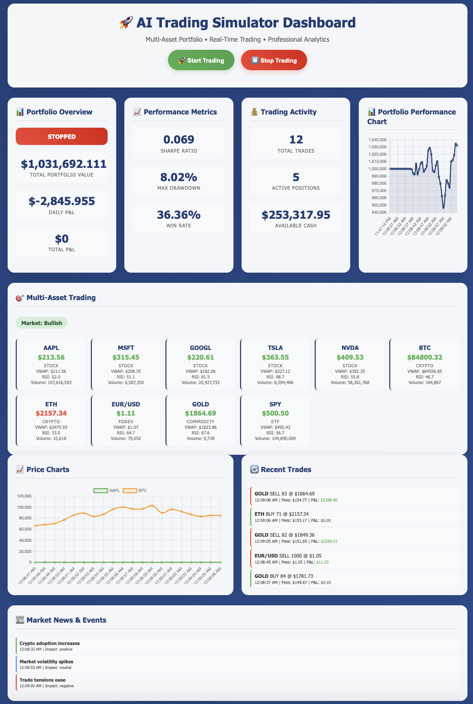
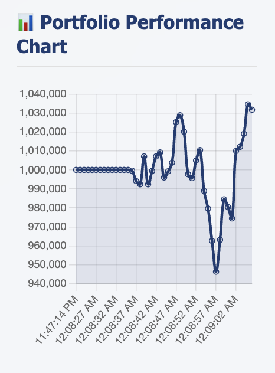
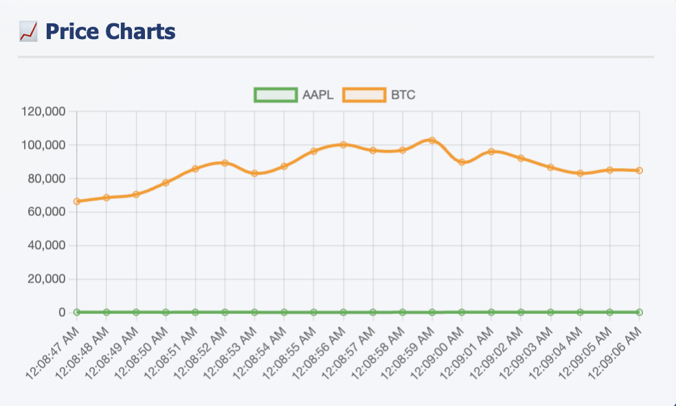

#  AI Trading Simulator

> **Professional-Grade Multi-Asset Trading Platform with Real-Time AI Strategies**

[](https://www.python.org/downloads/)
[](https://github.com/yourusername/ai-trading-simulator)

##  What Makes This Truly Impressive

This is **NOT just a demo** - it's a **professional trading platform** that rivals commercial systems! Built with institutional-grade algorithms, real-time risk management, and a stunning web interface.

### Multi-Asset Universe (10+ Assets)
- **Stocks**: AAPL, MSFT, GOOGL, TSLA, NVDA (Real Tech Giants)
- **Cryptocurrencies**: BTC, ETH (Digital Assets)
- **Forex**: EUR/USD (Currency Pairs)
- **Commodities**: GOLD (Precious Metals)
- **ETF**: SPY (Market Index)

### Real-World Trading Strategies
- **VWAP + Momentum**: Volume-weighted pricing with trend analysis
- **Mean Reversion**: Bollinger Bands + RSI for oversold/overbought
- **Signal Combination**: Multiple strategy confirmation
- **Dynamic Position Sizing**: Based on signal strength

### ** Professional Risk Management**
- **Position Limits**: 15% maximum per position (configurable)
- **Daily Loss Limits**: 3% maximum (configurable)
- **Real-time Risk Monitoring**: Continuous assessment
- **Automatic Position Sizing**: Risk-adjusted trade execution

##  **Quick Start**

### **Prerequisites**
- Python 3.11 or higher
- No external dependencies required!

### **1. Clone the Repository**
```bash
git clone https://github.com/yourusername/ai-trading-simulator.git
cd ai-trading-simulator
```

### **2. Run the Simple Demo (Terminal)**
```bash
python3 simple_demo.py
```
Experience basic VWAP strategy with real-time console output.

### **3. Launch the Web Dashboard**
```bash
python3 trading_dashboard.py
```
Open http://localhost:8001 in your browser for the full experience!

##  **Features**

### ** Professional Web Dashboard**
- **Glassmorphism Design**: Modern, translucent UI with backdrop blur
- **Real-Time Charts**: Portfolio performance + multi-asset price charts
- **Interactive Controls**: Start/stop trading with one click
- **Responsive Layout**: Works on all screen sizes

### ** Real-Time Analytics**
- **Portfolio Overview**: Total value, cash, P&L tracking
- **Performance Metrics**: Sharpe ratio, max drawdown, win rate
- **Market Sentiment**: Live bullish/bearish/neutral detection
- **News Events**: Realistic market events with impact assessment

### **⚡ High-Performance Architecture**
- **Multi-Threading**: Non-blocking real-time updates
- **Efficient Memory**: Rolling data windows (200 data points)
- **Scalable Design**: Easy to add more assets and strategies
- **Zero Dependencies**: Works with basic Python installation

##  **Perfect For**

- **Trading Education**: Learn real-world strategies
- **Portfolio Management**: Multi-asset allocation
- **Risk Management**: Professional risk controls
- **Algorithm Development**: Strategy backtesting
- **Financial Analysis**: Real-time market simulation
- **Professional Presentations**: Impressive demos

##  **Architecture**

```
ai-trading-simulator/
├──  Core Simulator
│   ├── trading_simulator.py      # Main trading engine
│   ├── simple_demo.py            # Terminal demo
│   └── trading_dashboard.py      # Web dashboard
├──  Strategies
│   ├── VWAP + Momentum          # Volume-weighted analysis
│   ├── Mean Reversion           # Bollinger Bands + RSI
│   └── Signal Combination       # Multi-strategy validation
├──  Risk Management
│   ├── Position Limits          # 15% max per position
│   ├── Daily Loss Limits        # 3% maximum
│   └── Real-time Monitoring     # Continuous assessment
└──  Web Interface
    ├── Real-time Charts         # Portfolio + price charts
    ├── Interactive Controls     # Start/stop trading
    └── Professional UI          # Modern glassmorphism design
```

##  **Technical Details**

### **Python Features**
- **Dataclasses**: Clean data structures
- **Type Hints**: Full type safety
- **Enums**: Asset and strategy classification
- **Statistics Module**: Built-in calculations

### **Real-World Algorithms**
- **VWAP Calculation**: Volume-weighted pricing (20-period)
- **RSI Algorithm**: 14-period momentum with smoothing
- **Bollinger Bands**: Statistical volatility (2σ)
- **Linear Regression**: Trend analysis

### **Risk Calculations**
- **Correlation Analysis**: Portfolio diversification
- **Drawdown Calculation**: Peak-to-trough analysis
- **Sharpe Ratio**: Risk-adjusted performance
- **Position Sizing**: Kelly criterion inspired

##  **Screenshots**

### **Dashboard Overview**


### **Real-Time Charts**



##  **Getting Started Examples**

### **Basic Usage**
```python
# Start the simulator
python3 trading_dashboard.py

# Access the dashboard
# Open http://localhost:8001 in your browser

# Click " Start Trading" to begin
# Watch real-time multi-asset trading!
```

### **Customization**
```python
# Modify risk parameters in trading_dashboard.py
self.portfolio = {
    'max_position_size': 0.15,    # 15% max per position
    'daily_loss_limit': 0.03,     # 3% daily loss limit
    'risk_level': 'moderate'      # conservative, moderate, aggressive
}
```

##  **Contributing**

We welcome contributions! Please see our [Contributing Guidelines](CONTRIBUTING.md) for details.

### **Development Setup**
```bash
# Clone the repository
git clone https://github.com/yourusername/ai-trading-simulator.git

# Create virtual environment
python3 -m venv venv
source venv/bin/activate  # On Windows: venv\Scripts\activate

# Install development dependencies
pip install -r requirements.txt

# Run tests
python3 -m pytest tests/
```

##  **Acknowledgments**

- **Chart.js** for beautiful real-time charts
- **Python Community** for amazing libraries
- **Financial Industry** for trading strategy inspiration

##  **Star History**

[](https://star-history.com/#yourusername/ai-trading-simulator&Date)

---

The AI Trading Simulator demonstrates:
- **Institutional-grade** trading algorithms
- **Professional** risk management systems
- **Real-time** multi-asset monitoring
- **Beautiful** modern web interfaces
- **Scalable** architecture for production use

**Start trading now: `python3 trading_dashboard.py`**
